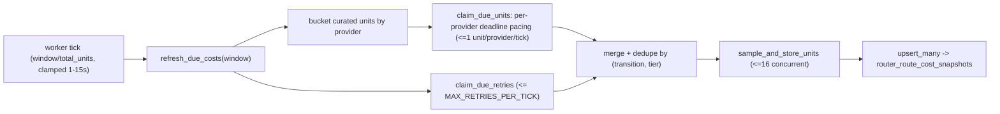
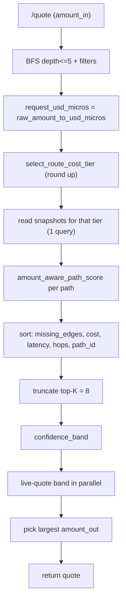

# Quoting system overview

> Canonical end-to-end description of the route-cost caching, refreshing,
> quoting, and visual-debugging stack. Keep it updated as the system changes.
>
> Last updated: 2026-06-08.

---

## 1. TL;DR

We maintain a curated cache of live-measured per-leg costs (in basis points)
for the bridge/swap hops we route through. A background worker keeps the cache
fresh by pacing all provider sample calls evenly across a 30-minute window. At
quote time we read the cache to rank candidate paths, then live-quote a small
set of the best ones in parallel and return the path that yields the most
output. An admin dashboard renders the cache and the routing graph for debugging.

Two invariants:

- The cache stores only costs measured from a provider. An unmeasured leg has no
  row and scores as `missing_edges` rather than as a fabricated cost.
- The cache only ranks paths; it never prices them. The user-facing
  `estimated_amount_out` always comes from a request-time live quote, so cache
  staleness cannot affect the number a user is shown.

---

## 2. Assets and the curated allowlist

`CanonicalAsset`
([`crates/router-core/src/services/asset_registry.rs`](../crates/router-core/src/services/asset_registry.rs))
is the single asset universe: `BTC`, `ETH`, `USDC`, `USDT`, `HYPE`. `HYPE` is a
Hyperliquid spot-venue asset used in balance/refund discovery; it is not part of
the curated bridge/swap list. Adding a routable asset means adding it here *and*
to the curated route tables.

`AssetRegistry::curated_cacheable_transitions` defines the hops that receive a
measured cost row, sampled **bidirectionally**. The BFS/routing graph is broader;
the allowlist only narrows what gets a cost row.

- **Across**: `USDC`, `ETH` between `ETH` / `BASE` / `ARB`; `USDT` between `ETH` /
  `BASE` only (Across has no usable USDT liquidity on Arbitrum, so USDT legs that
  touch `ARB` are excluded from the cache).
- **CCTP**: `USDC` between `ETH` / `BASE` / `ARB`.
- **Unit**: `HL.uETH <-> ETH.ETH`, `HL.uBTC <-> BTC.BTC`.
- **Hyperliquid bridge**: `ARB.USDC <-> HL.USDC` (native USDC bridge).
- **Hyperliquid spot**: `HL.USDC <-> HL.uBTC`, `HL.USDC <-> HL.uETH`. `HYPE`
  spot legs are not curated (no live USD reference price for value-loss bps).
- **Velora** (same-chain): `USDC <-> USDT` on `ETH` / `BASE` / `ARB`.

The anchor assets used for the arbitrary-ERC20 wrap (Section 6) are `USDC`,
`USDT`, `ETH`.

---

## 3. The tier ladder

Every curated hop is sampled at a ladder of trade sizes, so a `$100` quote and a
`$5m` quote do not score a path identically. Twelve tiers, `$100`–`$10m`
(`ROUTE_COST_TIERS` in
[`route_costs.rs`](../crates/router-core/src/services/route_costs.rs)):

`100 / 1k / 10k / 25k / 50k / 75k / 100k / 200k / 500k / 1m / 5m / 10m` (USD).

At quote time `select_route_cost_tier` rounds **up** to the smallest tier that
covers the request (slippage-conservative); above `$10m` it clamps to the top
tier.

---

## 4. The cache table

`router_route_cost_snapshots` (Postgres), one row per
`(transition_id, amount_bucket)`, managed by
[`route_cost_repo.rs`](../crates/router-core/src/db/route_cost_repo.rs).

| Field | Meaning |
| --- | --- |
| `estimated_fee_bps` | Per-leg fee in basis points (1 bp = 0.01%); the value loss the provider quoted. |
| `estimated_fee_usd_micros` | Same fee in USD micros at the tier's sample size. |
| `estimated_gas_usd_micros` | `0` for curated rows (cost folded into fee bps). |
| `estimated_latency_ms` | `0` for curated rows. |
| `sample_amount_usd_micros` | The tier sample size this row was measured at. |
| `quote_source` | `provider_quote:<id>` for every row. |
| `refreshed_at` / `expires_at` | When the row was written / its TTL expiry (~10 min). |

The upsert overwrites a row only when the incoming `refreshed_at` is newer, so a
late-arriving stale sample cannot clobber fresher data.

---

## 5. The paced refresher

`RouteCostService`
([`route_costs.rs`](../crates/router-core/src/services/route_costs.rs)), driven by
the worker loop in
[`worker.rs`](../bin/router-server/src/worker.rs).

### The window

The full work set is `curated_edges x 12 tiers`. Rather than burst-refreshing,
all sample calls are spread evenly across a configurable window
(`worker_route_cost_refresh_seconds`, default `1800` = 30 min): every provider is
trickled fresh quotes, one full sweep finishes per window, then re-anchors.



### Pacing

- **Per-provider metronomes** (`claim_due_units` → `claim_due_units_paced`): the
  plan is bucketed by provider; each provider is deadline-paced on its own cycle
  clock. A provider with `N` cells fires roughly one sample every `window / N`
  (e.g. 216 Across cells over 30 min ≈ one Across request every ~8.3s),
  independent of the other providers. Each keeps a `ProviderCursor` (cycle start
  + next unit) in a shared `Arc<Mutex<BTreeMap<provider, ProviderCursor>>>`;
  cursors for providers dropped from the allowlist are removed.
- **Deadline pacing** (`paced_target_index`): each tick computes how many of a
  provider's units should be done by now (`provider_cells * elapsed / window`)
  and samples up to that index. At end of cycle the cursor re-anchors a fresh
  cycle at its own "now".
- **Tick rate** (`route_cost_pacing_tick`): `(window / total_units).clamp(1s,
  15s)`, sized to total work so each provider advances at most one unit per tick.
- **Distinct-route ordering** (`interleaved_refresh_plan`): within a provider,
  units are ordered tier-outer/route-inner, so consecutive samples step through
  different routes instead of all 12 tiers of one route back-to-back.
- **Concurrency**: each tick's slice is sampled behind a semaphore capped at
  `REFRESH_FANOUT_PERMITS = 16` outbound calls.

A single refresh error does not crash the worker: `run_route_cost_refresh` errors
are logged at `warn!` and the loop continues. A failed `(tier, transition)` cell
writes no row.

### Benign skips (not failures)

Some provider responses are expected non-results rather than failures - they
just mean the sampled tier notional is too large for the venue at that size.
These are recorded with the `skipped` outcome instead of `failed`:

- Hyperliquid spot orderbook-depth exhaustion (`book side could not absorb ...`,
  `empty book side`).
- Across `AMOUNT_TOO_HIGH` (HTTP 400; notional exceeds the route cap).
- A swap venue (Velora / HL spot) returning no route at this size - it cannot
  fill the sampled notional (insufficient liquidity).

The first two are matched by `is_benign_unsatisfiable_amount(reason)`; the
no-route case is the exchange sampler's `None` arm. Skipped samples write no
cost row, are shown neutrally in the activity feed (not in the failures panel or
category counts), and are **not** retried out of band: retrying the same
oversized tier cannot succeed, so the next paced sweep is the only re-sample.

### Failure classification and intelligent retry

Every failed sample is classified by `classify_failure(reason)` into a
`FailureCategory` (`rate_limited`, `timeout`, `no_route`, `upstream_server`,
`upstream_client`, `other`) from heuristics on the provider error string. The
category is persisted on the sample event (`failure_category` column) and surfaces
in the dashboard failures log.

Rather than wait for the next ~30-minute sweep, failures are re-attempted out of
band via an in-memory retry queue on `RouteCostService` (`retry_queue`, keyed by
`(transition_id, tier_label)`):

- On failure, `reschedule_failures` (re)inserts the cell with
  `due_at = now + retry_delay(attempts, category)` and increments `attempts`;
  success or a non-attemptable outcome removes the cell. After
  `RETRY_MAX_ATTEMPTS` (5) the entry is dropped and the normal paced sweep is the
  backstop.
- `retry_delay` is exponential (`base * 2^(attempts-1)`, clamped). Ordinary
  failures use `20s` base / `5m` cap; **rate-limited** failures back off harder
  (`60s` base / `10m` cap) so retries do not amplify provider throttling.
- Each tick, `refresh_due_costs` drains up to `MAX_RETRIES_PER_TICK` (8) due
  entries, merges them with the paced chunk (deduped by cell), and samples them in
  the same fanout-bounded (`<=16`) pass. Retry granularity therefore tracks the
  1-15s tick rather than the window length.

The retry queue is in-memory only; a worker restart simply falls back to the paced
sweep. Retried attempts emit normal sample events, so a fail-then-succeed pair is
visible in the activity feed.

### What a sample sends

For each cell, `live_cost_snapshot` dispatches by transition kind:

- **Bridges** (`AcrossBridge`, `CctpBridge`, `HyperliquidBridgeDeposit` /
  `HyperliquidBridgeWithdrawal`) → `quote_bridge` at the tier size; the value
  loss between `amount_in` and `amount_out` (in USD micros via the pricing
  snapshot) becomes the fee bps.
- **Exchange swaps** (`UniversalRouterSwap` Velora, `HyperliquidTrade` HL spot)
  → `ExchangeProvider::quote_trade` (`live_exchange_cost_snapshot`); value loss
  between the input and the exchange `amount_out` recorded as bps. The provider
  is resolved by the leg's provider id (`velora` / `hyperliquid_spot`).
- **Unit** (`UnitDeposit` / `UnitWithdrawal`) → Hyperunit `/v2/estimate-fees`;
  bps = `fee_native * 10_000 / sample_amount_native`.

Samples use fixed dummy depositor/recipient addresses and `min_amount_out = "1"`,
so cached fees are mildly optimistic versus a real user quote. This affects path
**selection** only, never the returned `estimated_amount_out`.

---

## 6. Arbitrary ERC20 routing (Velora runtime edges)

For a non-curated EVM token, the BFS layer splices in **per-request** Velora
`UniversalRouterSwap` legs around the user's source/destination
(`runtime_velora_transition_declarations`): source token → each anchor
(`USDC`/`USDT`/`ETH`) on the source chain, and each anchor → destination token on
the destination chain. The cached graph (Across/CCTP/Unit) covers the middle.

These edges have request-specific IDs and are not cached, so they score as
uncached (`missing_edges` bumped) and are pulled into the live-quote fanout where
each anchor choice is quoted and the output-maximizing combination wins.

---

## 7. Quote-time flow

Production path: `best_provider_quote`
([`order_manager.rs`](../bin/router-server/src/services/order_manager.rs)).



0. Validate/normalize the request. Quotes whose normalized source and
   destination are the **same asset on the same chain** (e.g. BTC -> BTC) are
   rejected up front (`InvalidRouting`, HTTP 400) - there is nothing to route,
   and path enumeration would otherwise surface nonsensical bridge-out-and-back
   round-trips. (Same canonical across different chains, e.g. `ETH.USDC ->
   BASE.USDC`, is still a valid cross-chain route.)
1. Convert `amount_in` to USD micros via the live pricing snapshot (falls back to
   `$1k` if pricing is missing).
2. Pick the tier (round up).
3. Read that tier's snapshots once (indexed query).
4. Score each path: a cached leg costs `max(cached_usd_micros,
   ceil(request_usd_micros * cached_bps / 10_000))`; an uncached leg adds zero
   cost but bumps `missing_edges`.
5. Sort deterministically `(missing_edges, cost, latency, hops, path_id)`.
6. Truncate to `TOP_K_PATHS = 8`.
7. Build the **confidence band** (leader + peers within `CONFIDENCE_BAND_BPS` =
   10% cost, or with `missing_edges > 0`, or with non-live-refreshed legs at
   `>= CONFIDENCE_BAND_LARGE_ORDER_USD_MICROS` = `$10k`).
8. Live-quote the band in parallel and validate each.
9. Return the path with the largest `estimated_amount_out` (tie-break hops,
   path_id).

The dashboard's explain endpoint (Section 8) reuses the same BFS → score → rank
pipeline but, instead of the variable-width confidence band, live-quotes a
hardcoded top-3 (`LIVE_QUOTE_TOP_N`) and persists nothing.

---

## 8. The admin dashboard (visual debugging)

`admin-dashboard` container, served at **`http://localhost:3000`** (remapped to
**`:13000`** under the full `just devnet up` ports overlay). Cache tables read the
**replica** Postgres directly; the graph/explain endpoints proxy the router
internal API (`routerInternalBaseUrl`).

API surface
([`apps/admin-dashboard/server/app.ts`](../apps/admin-dashboard/server/app.ts)):

| Endpoint | Source | Used by |
| --- | --- | --- |
| `GET /api/route-costs` | `router_route_cost_snapshots` (replica) | Route Costs tab |
| `GET /api/route-cost-events` | `router_route_cost_sample_events` (replica) | activity log + schedule timeline + failures panel |
| `GET /api/route-graph` | router internal API | Route Graph tab |
| `POST /api/route-explain` | router internal API | Route Graph ranking/demo |

### Route Costs tab

`RouteCostsView` ([`App.tsx`](../apps/admin-dashboard/src/App.tsx)) renders one
table per venue: rows are routes (`SRC.X -> DST.Y`), columns are the 12 tiers,
cells show live bps colored by magnitude (`rc-good/ok/warn/bad`). Polls every 30s.
Each venue header shows `<routes> routes · <tiers> price tiers · <grid> cells
(<cached> cached)` where `grid = routes x tiers`. The page also renders a
per-provider **refresh-schedule timeline** across the window and a **live
activity log**, both from `/api/route-cost-events`.

Below those, a **sampling failures panel** (`RouteCostFailuresPanel`) summarizes
failures in the window: a per-category badge row (counts per `FailureCategory`,
rate-limited called out most prominently) and a newest-first list of failed
samples showing provider, asset pair, tier, a category badge, and the raw provider
reason. Categories come from the persisted `failure_category` and drive both this
view and the worker's retry backoff (see §5).

### Route Graph tab

`RouteGraphView`
([`RouteGraph.tsx`](../apps/admin-dashboard/src/RouteGraph.tsx)) draws the full
declared corridor topology (every node and edge from `/api/route-graph`) and lets
you run rankings:

- Pick **source/destination** assets, a **tier**, and an **amount**. Changing any
  input auto-runs a **cache-only dry run** (`POST /api/route-explain` with
  `live_quote: false`): BFS + filters + ranking against cached bps only, no
  provider calls.
- The **Live quote** toggle additionally live-quotes the top-3 ranked paths to
  report real per-path `estimated_amount_out` and pick the true output-maximizing
  winner. It runs only on explicit rank (manual) to avoid hammering providers on
  every keystroke; a `live …ms` timing is shown when used.
- Ranked results render as cards: a header with the venue sequence and a summary
  (`Σ` total path bps, hop count, uncached count, latency, est. out), and a hop
  chain showing each leg's **per-step bps** (cached value, `live` for Velora, or
  `—` for legs with no cached cost such as `HyperliquidTrade`/HL bridge). The
  total `Σ bps` sums cached legs only and is shown as `Σ ≥… bps` when some legs
  are live/uncached. The `#1` rank and the live-quote winner are highlighted
  green; lower ranks are neutral.

### Starting it

`just devnet up` explicitly stops `admin-dashboard`; bring it up with the build
flag:

```bash
just devnet up -d --build admin-dashboard
```

---

## 9. Devnet mock fees

The devnet mock integrators quote tier-varying fees so dashboard cells are
non-zero. They are env-configurable (no Rust rebuild needed — `just devnet up -d
devnet` to apply) in
[`etc/compose.local-devnet.yml`](../etc/compose.local-devnet.yml):

| Knob | Value | Effect |
| --- | --- | --- |
| `MOCK_ACROSS_QUOTE_FEE_BPS` | `8` | Base Across haircut. |
| `MOCK_ACROSS_QUOTE_JITTER_BPS` | `6` | Size-varying jitter so tiers differ. |
| `MOCK_VELORA_QUOTE_FEE_BPS` | `4` | Velora same-chain swap haircut. |
| `CCTP_TRANSFER_MODE` (router-api) | `fast` | Fast-lane quotes (~1.3 bps). |

Implemented in `crates/devnet/src/mock_integrators.rs`
(`mock_velora_quote_amounts`, `with_velora_quote_fee_bps`) and
`crates/devnet/src/lib.rs` (`setup_mock_integrators`).

---

## 10. Config knobs

| Knob | Where | Effect |
| --- | --- | --- |
| `worker_route_cost_refresh_seconds` (`ROUTER_WORKER_ROUTE_COST_REFRESH_SECONDS`) | [`lib.rs`](../bin/router-server/src/lib.rs) (default `1800`) | Refresh window; all curated samples are spread evenly across it. |
| `route_cost_pacing_tick` | [`worker.rs`](../bin/router-server/src/worker.rs) | `(window/total_units).clamp(1s,15s)`; sizes the tick so each provider advances <=1 unit per tick. |
| `REFRESH_FANOUT_PERMITS` | [`route_costs.rs`](../crates/router-core/src/services/route_costs.rs) (`16`) | Max concurrent provider calls per tick. |
| `DEFAULT_REFRESH_TTL` | [`route_costs.rs`](../crates/router-core/src/services/route_costs.rs) (`600s`) | Row expiry. |
| `RETRY_MAX_ATTEMPTS` / `MAX_RETRIES_PER_TICK` | [`route_costs.rs`](../crates/router-core/src/services/route_costs.rs) (`5` / `8`) | Retry-queue give-up bound / max due retries folded into one tick. |
| `RETRY_BASE_DELAY` / `RETRY_MAX_DELAY` | [`route_costs.rs`](../crates/router-core/src/services/route_costs.rs) (`20s` / `5m`) | Exponential backoff base/cap for ordinary failures. |
| `RETRY_RATE_LIMITED_BASE_DELAY` / `RETRY_RATE_LIMITED_MAX_DELAY` | [`route_costs.rs`](../crates/router-core/src/services/route_costs.rs) (`60s` / `10m`) | Harder backoff base/cap for rate-limited failures. |
| `CONFIDENCE_BAND_BPS` | [`route_costs.rs`](../crates/router-core/src/services/route_costs.rs) (`1_000` = 10%) | Cost band width around the leader for fanout. |
| `CONFIDENCE_BAND_LARGE_ORDER_USD_MICROS` | same file (`$10k`) | Above this, band widens for non-live-refreshed legs. |
| `TOP_K_PATHS` / `MAX_PATH_DEPTH` | [`order_manager.rs`](../bin/router-server/src/services/order_manager.rs) (`8` / `5`) | Ranked-candidate cap / BFS depth. |
| `LIVE_QUOTE_TOP_N` | [`order_manager.rs`](../bin/router-server/src/services/order_manager.rs) (`3`) | Paths live-quoted by the dashboard explain endpoint. |

---

## 11. Source map

| Concern | File |
| --- | --- |
| Tier table, scoring, paced refresher, live samplers, confidence band | [`route_costs.rs`](../crates/router-core/src/services/route_costs.rs) |
| Canonical assets, curated allowlist, runtime Velora edges, graph | [`asset_registry.rs`](../crates/router-core/src/services/asset_registry.rs) |
| Provider traits (bridge/exchange/unit fee) | [`action_providers.rs`](../crates/router-core/src/services/action_providers.rs) |
| Cache persistence | [`route_cost_repo.rs`](../crates/router-core/src/db/route_cost_repo.rs) |
| Sample-event persistence | [`route_cost_event_repo.rs`](../crates/router-core/src/db/route_cost_event_repo.rs) |
| Worker loop / pacing | [`worker.rs`](../bin/router-server/src/worker.rs) |
| Quote + explain wiring | [`order_manager.rs`](../bin/router-server/src/services/order_manager.rs) |
| Dashboard cache endpoints | [`server/route-costs.ts`](../apps/admin-dashboard/server/route-costs.ts), [`server/route-cost-events.ts`](../apps/admin-dashboard/server/route-cost-events.ts) |
| Dashboard graph/explain proxy | [`server/route-graph.ts`](../apps/admin-dashboard/server/route-graph.ts) |
| Dashboard UI | [`App.tsx`](../apps/admin-dashboard/src/App.tsx), [`RouteGraph.tsx`](../apps/admin-dashboard/src/RouteGraph.tsx) |
| Devnet mock fees | [`mock_integrators.rs`](../crates/devnet/src/mock_integrators.rs), [`etc/compose.local-devnet.yml`](../etc/compose.local-devnet.yml) |

---

## 12. Known limitations

- `HYPE` Hyperliquid spot legs are not curated (no live USD reference price for
  value-loss bps), so they show as uncached (`—`) and are priced only by the
  request-time fanout. Other HL spot pairs (`USDC <-> uBTC/uETH`) and the native
  USDC bridge are now sampled and cached.
- Limit orders and the temporal boundary requote pin to a fixed `$1k` anchor and
  skip the fanout.
- The retry queue is in-memory; a worker restart drops pending retries and falls
  back to the paced sweep. `classify_failure` is heuristic on provider error
  strings, so categories are best-effort.

---

## 13. Keeping this doc current

When you change any of the following, update the matching section:

- Canonical assets or the curated allowlist → Section 2.
- The tier ladder → Section 3.
- The cache schema → Section 4.
- Refresh window, pacing, or robustness → Section 5 / Section 10.
- Quote-time ranking/fanout → Section 7 / Section 10.
- The dashboard surface → Section 8.
- Devnet mock fee defaults → Section 9.

Bump the "Last updated" date on every edit.
