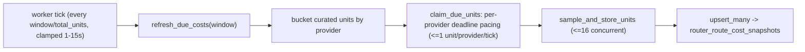
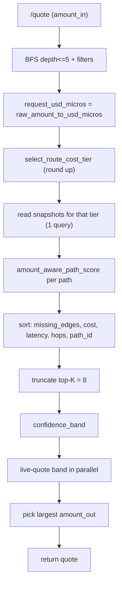

# Route-cost system: end-to-end overview

> **Living document.** This is the canonical end-to-end rundown of the
> route-cost caching, refreshing, quoting, and visual-debugging stack. Keep it
> updated as the system changes. For the ranking/scoring deep-dive (confidence
> band, tiebreaks, telemetry) see
> [`docs/route-cost-ranking.md`](./route-cost-ranking.md).
>
> Last updated: 2026-06-06.

---

## 1. TL;DR

We maintain a small, **curated** cache of real, live-measured per-leg costs
(in basis points) for the bridge/swap hops we actually route through. A
background worker keeps that cache continuously fresh by **pacing** all of its
provider sample calls evenly across a 30-minute window. At quote time we read
the cache to rank candidate paths, then live-quote a small "confidence band"
of the best ones in parallel and return the path that yields the most output.
An admin dashboard renders the cache so we can visually debug it.

Two hard rules shape everything:

- **No guessing.** We only store costs we actually measured from a provider.
  There are no fabricated "structural" seed estimates. An unmeasured leg stays
  legitimately absent.
- **The cache only ranks; it never prices.** The user-facing
  `estimated_amount_out` always comes from a request-time live quote, so cache
  staleness can never leak into the number a user is shown.

---

## 2. Assets and the curated allowlist

We cache an explicit allowlist of hops, sampled **bidirectionally**, defined in
`AssetRegistry::curated_cacheable_transitions`
([`crates/router-core/src/services/asset_registry.rs`](../crates/router-core/src/services/asset_registry.rs)).
The BFS/routing graph is intentionally broader; the allowlist only narrows what
gets a measured *cost* row.

- **Across**: `USDT`, `USDC`, `ETH` between `ETH` / `BASE` / `ARB`.
- **CCTP**: `USDC` between `ETH` / `BASE` / `ARB`.
- **Unit**: `HL.uETH <-> ETH.ETH`, `HL.uBTC <-> BTC.BTC`.
- **Velora** (same-chain): `USDC <-> USDT` on `ETH` / `BASE` / `ARB`.

Canonical anchor assets used for the arbitrary-ERC20 wrap (Section 6) are the
three main tokens: `USDC`, `USDT`, `ETH`. The router's canonical asset set is
exactly `BTC`, `ETH`, `USDC`, `USDT` — the assets used in the curated cache swap
list above; there is no separate asset universe.

---

## 3. The tier ladder

Every curated hop is sampled at a ladder of trade sizes so a `$100` quote and a
`$5m` quote do not score a path identically. Twelve tiers, `$100` to `$10m`
(`ROUTE_COST_TIERS` in
[`route_costs.rs`](../crates/router-core/src/services/route_costs.rs)):

`100 / 1k / 10k / 25k / 50k / 75k / 100k / 200k / 500k / 1m / 5m / 10m` (USD).

At quote time `select_route_cost_tier` rounds **up** to the smallest tier that
covers the request (slippage-conservative); above `$10m` it clamps to the top
tier.

---

## 4. The cache table

Persistent store: `router_route_cost_snapshots` (Postgres), one row per
`(transition_id, amount_bucket)`, managed by
[`crates/router-core/src/db/route_cost_repo.rs`](../crates/router-core/src/db/route_cost_repo.rs).

| Field | Meaning |
| --- | --- |
| `estimated_fee_bps` | Per-leg fee in basis points (1 bp = 0.01%). The real value loss the provider quoted. |
| `estimated_fee_usd_micros` | Same fee in USD micros at the tier's sample size. |
| `estimated_gas_usd_micros` | Always `0` for curated rows (all cost folded into fee bps). |
| `estimated_latency_ms` | Always `0` for curated rows. |
| `sample_amount_usd_micros` | The tier sample size this row was measured at. |
| `quote_source` | Always `provider_quote:<id>` - every row is a live measurement. |
| `refreshed_at` / `expires_at` | When the row was written / when it expires (TTL ~10 min). |

The upsert only overwrites a row when the incoming `refreshed_at` is newer, so
late-arriving stale samples can't clobber fresher data.

---

## 5. The paced refresher

Lives in `RouteCostService`
([`route_costs.rs`](../crates/router-core/src/services/route_costs.rs)); driven
by the worker loop in
[`bin/router-server/src/worker.rs`](../bin/router-server/src/worker.rs).

### The window concept

The full set of work units is `curated_edges x 12 tiers`. Instead of
burst-refreshing everything every N minutes, we spread **all** sample calls
evenly across a configurable **window** (`worker_route_cost_refresh_seconds`,
default `1800` = 30 min). So at any moment every provider is being trickled
fresh quotes; one complete sweep finishes once per window, then re-anchors.



### How pacing works

- **Per-provider metronomes** (`claim_due_units` -> `claim_due_units_paced`):
  the work plan is bucketed by provider and each provider is deadline-paced on
  its **own** cycle clock. A provider with `N` cells fires one sample roughly
  every `window / N`; with 216 Across cells over a 30-min window that is one
  Across request about every ~8.3s, independent of how often CCTP/Unit/Velora
  fire. Each provider keeps its own `ProviderCursor` in a shared
  `Arc<Mutex<BTreeMap<provider, ProviderCursor>>>` (cycle start + next unit);
  cursors for providers no longer in the allowlist are dropped.
- **Deadline pacing** (`paced_target_index`): per provider, each tick computes
  how many of *that provider's* units should be done by now
  (`provider_cells * elapsed / window`) and samples up to that index. When a
  provider's cursor reaches the end, its next pass re-anchors a fresh cycle at
  its own "now".
- **One-by-one tick rate** (`route_cost_pacing_tick`):
  `(window / total_units).clamp(1s, 15s)`, where `total_units = curated_edges x
  12`. Because the tick is sized to the *total* work, every provider advances at
  most one unit per tick, so requests fire one at a time rather than in bursts.
  A tick may still surface one due unit from each of several providers at once,
  but no single provider bunches.
- **Distinct-route ordering** (`interleaved_refresh_plan`): within a provider,
  work units are ordered tier-outer/route-inner (one tier across every route
  before advancing to the next tier). Combined with one-by-one pacing,
  consecutive samples for a venue step through *different routes* instead of
  firing all 12 tiers of a single route back-to-back, so the activity feed
  visibly cycles through every cell. (Also reused by the full-sweep
  `refresh_anchor_costs`.)
- **Concurrency**: each tick's (now tiny) slice is sampled concurrently behind a
  semaphore capped at `REFRESH_FANOUT_PERMITS = 16` outbound provider calls.

### Robustness

A single refresh error does **not** crash the worker. `run_route_cost_refresh`
errors are logged as `warn!` and the loop continues
(`handle_route_cost_task_result`). Within a cycle, a failed/unattemptable
`(tier, transition)` cell simply writes **no row** and is retried next sweep.

### What a sample actually sends

For each cell, `live_cost_snapshot` dispatches by transition kind:

- **Bridges** (`AcrossBridge`, `CctpBridge`, HL bridges) -> `quote_bridge` at the
  tier size; the value loss between `amount_in` and `amount_out` (converted to
  USD micros via the pricing snapshot) becomes the fee bps.
- **Velora** (`UniversalRouterSwap`) -> `ExchangeProvider::quote_trade` for the
  curated same-chain pair; value loss recorded as bps.
- **Unit** (`UnitDeposit` / `UnitWithdrawal`) -> Hyperunit `/v2/estimate-fees`;
  bps = `fee_native * 10_000 / sample_amount_native`.

**Known sampling caveats** (audit S2.12): samples use fixed dummy depositor/
recipient addresses and `min_amount_out = "1"`, so cached fees are mildly
optimistic vs. a real user quote. This only affects path **selection** - never
the returned `estimated_amount_out`.

---

## 6. Arbitrary ERC20 routing (Velora runtime edges)

For any non-curated EVM token, the BFS layer splices in **per-request** Velora
`UniversalRouterSwap` legs around the user's source/destination
(`runtime_velora_transition_declarations`): from the source token to each anchor
(`USDC`/`USDT`/`ETH`) on the source chain, and from each anchor to the
destination token on the destination chain. The cached graph (Across/CCTP/Unit)
covers the middle.

These edges are **not cached** (their IDs are request-specific). They score as
uncached (zero fabricated cost, `missing_edges` bumped), which forces them into
the confidence-band fanout where each anchor choice is live-quoted and the
output-maximizing combination wins. That is the "try every anchor, keep the
best" wrap.

---

## 7. Quote-time flow



1. Convert `amount_in` to USD micros via the live pricing snapshot (falls back
   to `$1k` if pricing is missing).
2. Pick the tier (round up).
3. Read that tier's snapshots once (indexed query).
4. Score each path: a cached leg costs
   `max(cached_usd_micros, ceil(request_usd_micros * cached_bps / 10_000))`; an
   uncached leg adds zero cost but bumps `missing_edges`.
5. Sort deterministically `(missing_edges, cost, latency, hops, path_id)`.
6. Truncate to `TOP_K_PATHS = 8`.
7. Build the **confidence band** (leader + peers within 10% cost, or with
   `missing_edges > 0`, or non-live-refreshed legs at `>= $10k`).
8. Live-quote the band in parallel; validate each.
9. Return the path with the largest `estimated_amount_out` (tie-break hops,
   path_id).

Full detail in [`docs/route-cost-ranking.md`](./route-cost-ranking.md).

---

## 8. The admin dashboard (visual debugging)

Served by the `admin-dashboard` container at **`http://localhost:3000`** in the
local devnet; it reads the **replica** Postgres directly (no router API hop).

- **Backend**: `GET /api/route-costs`
  ([`apps/admin-dashboard/server/app.ts`](../apps/admin-dashboard/server/app.ts))
  -> `fetchRouteCostSnapshots`
  ([`server/route-costs.ts`](../apps/admin-dashboard/server/route-costs.ts))
  queries `router_route_cost_snapshots`.
- **Frontend**: the **Route Costs** tab (`RouteCostsView` in
  [`apps/admin-dashboard/src/App.tsx`](../apps/admin-dashboard/src/App.tsx))
  renders one table per venue: rows are routes (`SRC.X -> DST.Y`), columns are
  the 12 tiers, cells show live bps colored by magnitude
  (`rc-good/ok/warn/bad`). It polls every 30s. Each venue header shows
  `<routes> routes · <tiers> price tiers · <grid> cells (<cached> cached)`,
  where `grid = routes x tiers` and `cached` is how many of those cells
  currently have a live snapshot.
- The page also renders a **refresh-schedule timeline** (per-provider lanes
  across the window) and a **live activity log**, both fed by
  `GET /api/route-cost-events` over the `router_route_cost_sample_events` table.

### Starting it

`just devnet up` explicitly stops `admin-dashboard`; bring it up with the build
flag:

```bash
just devnet up -d --build admin-dashboard
```

### Gotchas already fixed

- Empty `SUPABASE_CHATS_URL` used to crash the server; `server/config.ts` now
  normalizes empty secrets to `None`.
- An old worker image overflowed `estimated_gas_usd_micros`; curated rows now
  write `0` gas.

---

## 9. Devnet mock fees

By default the devnet mock integrators quoted 1:1 (zero fees), which made every
dashboard cell `0`. Mock fees are now env-configurable (no Rust rebuild needed
to tune them - `just devnet up -d devnet` to apply) and set to realistic,
tier-varying values in
[`etc/compose.local-devnet.yml`](../etc/compose.local-devnet.yml):

| Knob | Value | Effect |
| --- | --- | --- |
| `MOCK_ACROSS_QUOTE_FEE_BPS` | `8` | Base Across haircut. |
| `MOCK_ACROSS_QUOTE_JITTER_BPS` | `6` | Size-varying jitter so tiers differ. |
| `MOCK_VELORA_QUOTE_FEE_BPS` | `4` | Velora same-chain swap haircut. |
| `CCTP_TRANSFER_MODE` (router-api) | `fast` | Fast lane quotes ~1.3 bps instead of 0. |

Implemented in `crates/devnet/src/mock_integrators.rs` (`mock_velora_quote_amounts`,
`with_velora_quote_fee_bps`) and `crates/devnet/src/lib.rs` (`setup_mock_integrators`).

---

## 10. Config knobs

| Knob | Where | Effect |
| --- | --- | --- |
| `worker_route_cost_refresh_seconds` (`ROUTER_WORKER_ROUTE_COST_REFRESH_SECONDS`) | [`bin/router-server/src/lib.rs`](../bin/router-server/src/lib.rs) (default `1800`) | The refresh **window**: all curated samples are spread evenly across it. |
| `route_cost_pacing_tick` | [`worker.rs`](../bin/router-server/src/worker.rs) | `(window/total_units).clamp(1s,15s)` - sized so each provider advances <=1 unit per tick (one-by-one pacing). |
| `REFRESH_FANOUT_PERMITS` | [`route_costs.rs`](../crates/router-core/src/services/route_costs.rs) (`16`) | Max concurrent provider calls per tick. |
| `DEFAULT_REFRESH_TTL` | [`route_costs.rs`](../crates/router-core/src/services/route_costs.rs) (`600s`) | Row expiry. |
| `CONFIDENCE_BAND_BPS` | [`route_costs.rs`](../crates/router-core/src/services/route_costs.rs) (`1_000` = 10%) | Cost band width around the leader for fanout. |
| `CONFIDENCE_BAND_LARGE_ORDER_USD_MICROS` | same file (`$10k`) | Above this, band widens for non-live-refreshed legs. |
| `TOP_K_PATHS` / `MAX_PATH_DEPTH` | `bin/router-server/src/services/order_manager.rs` (`8` / `5`) | Ranked-candidate cap / BFS depth. |

---

## 11. Source map

| Concern | File |
| --- | --- |
| Tier table, scoring, paced refresher, live samplers | [`crates/router-core/src/services/route_costs.rs`](../crates/router-core/src/services/route_costs.rs) |
| Curated allowlist + runtime Velora edges | [`crates/router-core/src/services/asset_registry.rs`](../crates/router-core/src/services/asset_registry.rs) |
| Provider traits (bridge/exchange/unit fee) | [`crates/router-core/src/services/action_providers.rs`](../crates/router-core/src/services/action_providers.rs) |
| Cache persistence | [`crates/router-core/src/db/route_cost_repo.rs`](../crates/router-core/src/db/route_cost_repo.rs) |
| Worker loop / pacing | [`bin/router-server/src/worker.rs`](../bin/router-server/src/worker.rs) |
| Quote wiring (`best_provider_quote`) | [`bin/router-server/src/services/order_manager.rs`](../bin/router-server/src/services/order_manager.rs) |
| Dashboard endpoint | [`apps/admin-dashboard/server/route-costs.ts`](../apps/admin-dashboard/server/route-costs.ts) |
| Dashboard UI | [`apps/admin-dashboard/src/App.tsx`](../apps/admin-dashboard/src/App.tsx) (`RouteCostsView`) |
| Devnet mock fees | [`crates/devnet/src/mock_integrators.rs`](../crates/devnet/src/mock_integrators.rs), [`etc/compose.local-devnet.yml`](../etc/compose.local-devnet.yml) |

---

## 12. In-flight / roadmap

- **Per-request activity feed** (shipped): the refresher writes a
  `router_route_cost_sample_events` row per sample
  ([`route_cost_event_repo.rs`](../crates/router-core/src/db/route_cost_event_repo.rs));
  the dashboard surfaces it as a live activity log, a per-provider schedule
  timeline across the window, and edge/API-request counters (Section 8).
- `HyperliquidTrade` has no live sampler; it is priced purely by the fanout.
- Limit orders and the temporal boundary requote pin to a fixed `$1k` anchor and
  skip the fanout (audit S1.8 / S1.10).

---

## 13. Keeping this doc current

When you change any of the following, update the matching section here:

- The curated allowlist or anchor assets -> Section 2.
- The tier ladder -> Section 3.
- The cache schema -> Section 4.
- Refresh window, pacing, or robustness behavior -> Section 5 / Section 10.
- The dashboard surface -> Section 8 (and flip Section 12 when the activity feed
  ships).
- Devnet mock fee defaults -> Section 9.

Bump the "Last updated" date at the top on every edit.
